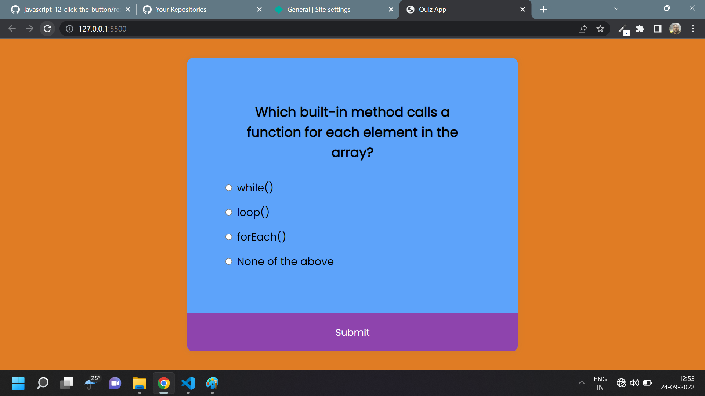

# Javascript Assignment JS Quiz App

## JS Quiz App [Live Link](https://name-conversion-js.netlify.app/)

- Skills Gained in this project

  - select answer using foreach loop and checked and increase the score and deselect the value when answer sumitted

  - load question using inner html

---

## Time taken to finish this project

- 1 hour 35 minutes to complete it

#### Screenshot

